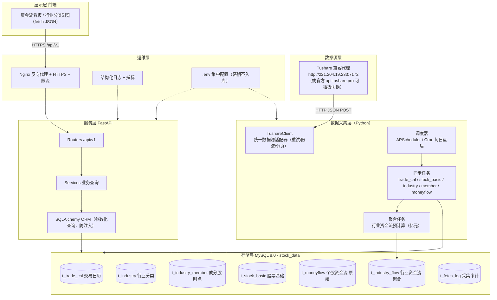

# 申万行业资金流看板 · 架构设计

> 版本：v1.0　|　面向：客户演示 / 生产部署　|　密级：内部

## 1. 项目定位

面向客户展示 **申万行业（一/二/三级）分类 + 行业/个股资金流** 的可视化看板。
数据为**真实行情数据**，由后端每日从数据源同步并聚合到 MySQL，前端只读展示，**不使用任何模拟数据**。

## 2. 现状勘察结论（决定本方案的依据）

| # | 结论 | 影响 |
|---|------|------|
| 1 | 现有看板（`fundflow.html` 等）资金流为**前端伪随机 mock** | 给客户看前必须替换为真实数据 |
| 2 | 数据源为 **Tushare 兼容代理** `http://221.204.19.233:7172`，token 位于 `C:\Users\57424\jsdata_tk.csv`（56 位，非官方 40 位） | 依赖第三方代理；官方 `api.tushare.pro` 不认此 token |
| 3 | 现有 `fetch_industry_flow.py` 请求 `/query`、解析 `ok/error/rows`，与代理当前返回的 `code/msg/data` 契约**不匹配** | 采集脚本需重写 |
| 4 | 代理已验证支持 `moneyflow`、`index_member`、`trade_cal`，返回官方 `fields/items/has_more` 结构 | 可直接对接，但需处理分页与限流 |
| 5 | 本机 MySQL 8.0 已运行（`stock_data` 库）、Docker/Python3.13/Node 可用 | 无需额外基础设施 |

> 安全提醒：数据源为 **HTTP 明文** 且 token 走请求体。生产环境需评估改用官方 Tushare Pro（HTTPS）或为该代理加 HTTPS 网关。

## 3. 总体架构



### 分层职责（文字版）

| 层 | 职责 | 关键约束 |
|----|------|----------|
| 数据源层 | 提供行情/分类原始数据 | 网络只读；不把 token 暴露给前端 |
| 采集层 ETL | 定时拉取、清洗、聚合、入库 | 幂等可重跑、断点续传、失败重试、时点成分 |
| 存储层 MySQL | 落库原始 + 聚合数据 | utf8mb4、InnoDB、索引覆盖查询、只读账号给 API |
| 服务层 FastAPI | 对外 REST API、鉴权、缓存、限流 | 参数化查询、统一错误码、响应脱敏 |
| 展示层 前端 | 渲染看板，仅通过 API 取数 | 不在前端伪造数据；静态资源走 Nginx |
| 运维层 | HTTPS、日志、监控、配置 | 密钥只存在于 `.env`，不进 git |

## 4. 数据流

```
盘后定时任务（工作日 17:30）
  ├─ ① 同步交易日历 trade_cal（增量）
  ├─ ② 同步股票基础 stock_basic（增量）
  ├─ ③ 同步行业分类 industry（全量，131 二级 + 336 三级）
  ├─ ④ 同步成分股 index_member（时点：in_date/out_date，覆盖历史调入调出）
  ├─ ⑤ 同步个股资金流 moneyflow（逐交易日，按 ts_code 过滤成分股，增量）
  └─ ⑥ 聚合行业资金流 t_industry_flow（小/中/大/超大单 → 净额，万元→亿元）
         ↓
前端请求 GET /api/v1/... → FastAPI 查询 MySQL → JSON 返回
```

## 5. 技术选型

| 组件 | 选型 | 理由 |
|------|------|------|
| 后端框架 | FastAPI + Uvicorn | 高性能、自动 OpenAPI、类型校验、易对接前端 |
| ORM / 迁移 | SQLAlchemy 2.x + Alembic | 参数化防注入、schema 版本化、可回滚 |
| 配置 | pydantic-settings + `.env` | 密钥/连接串不硬编码 |
| 数据库 | MySQL 8.0（复用本机实例） | 已部署，`stock_data` 库 |
| 采集调度 | APScheduler（进程内）或系统 Cron | 简单可靠，可观测 |
| 缓存（可选） | Redis / 进程内 TTL | 行业列表/聚合数据热点缓存 |
| 部署 | Docker Compose（API + Nginx） | 环境一致、一键起停 |
| 前端 | 复用现有 HTML，改为 `fetch` 调 API | 最小改动，避免重写 UI |

## 6. 安全设计

1. **密钥管理**：DB 密码、数据源 token、API Key 全部放 `.env`（提供 `.env.example`），**禁止写入源码或数据库**；`.gitignore` 排除 `.env`。
2. **传输加密**：对外统一 Nginx HTTPS；数据源若可用官方 `api.tushare.pro`（HTTPS）优先，代理仅作回退。
3. **最小权限**：API 连库使用**只读账号** `stock_read`（`SELECT` only），采集使用 `stock_etl`（读写）；禁用 root 给应用。
4. **鉴权**：读接口可选 `X-Api-Key`；管理接口（触发采集）必须 `X-Admin-Key` + IP 白名单。
5. **注入防护**：全量走 SQLAlchemy ORM / 参数化查询，禁止拼接 SQL；输入校验用 Pydantic。
6. **限流**：Nginx `limit_req` + 接口级限流，防刷。
7. **日志脱敏**：不记录 token、密码、手机号等；日志含 `traceId` 便于排障。

## 7. 部署拓扑

```
                         ┌─────────────────────────────┐
  客户浏览器 ──HTTPS──▶  │  Nginx (443, 静态资源+反代)  │
                         └──────────────┬──────────────┘
                                        │ /api/v1
                         ┌──────────────▼──────────────┐
                         │  FastAPI (uvicorn :8000)    │──▶ MySQL 8.0 :3306
                         └──────────────┬──────────────┘
                                        │ 盘后定时
                         ┌──────────────▼──────────────┐
                         │  ETL 采集（同容器或独立）     │──▶ 数据源代理
                         └─────────────────────────────┘
```

- 单机演示：`docker compose up` 起 Nginx + API + ETL，MySQL 用本机实例。
- 生产：MySQL 建议独立/主从，API 可横向扩展（无状态），ETL 单实例（防并发写冲突）。

## 8. 可观测性

- 结构化日志（JSON）：请求日志、ETL 任务日志、慢查询日志。
- 采集审计：`t_fetch_log` 记录每次任务 `status/rows_fetched/rows_written/error_msg`。
- 健康检查：`GET /api/v1/health` 返回 DB 连通性与最新数据日期。

## 9. 实施路线（分阶段）

| 阶段 | 内容 | 验收标准 |
|------|------|----------|
| P0 数据层 | 建库建表（迁移脚本）、重写 `TushareClient` 适配代理契约 | 能正确拉取并入库，`t_fetch_log` 有记录 |
| P1 服务层 | FastAPI 骨架 + 行业/资金流/搜索接口 | 接口返回真实数据，通过 pytest |
| P2 展示层 | 现有 HTML 改 `fetch` 调 API，替换 mock | 页面数据与库中一致，标注数据日期 |
| P3 运维 | Nginx+HTTPS、`.env`、只读账号、定时任务、监控 | 一键部署，密钥不落盘 |
| P4 加固 | 缓存、限流、告警、数据源切换官方 Tushare | 压测 + 断网/限流演练 |

## 10. 风险与回滚

| 风险 | 等级 | 缓解 | 回滚 |
|------|------|------|------|
| 数据源代理不可用/变更契约 | 高 | 数据源适配器可插拔，支持官方 Tushare 切换；采集失败告警 | 回退到最近一次成功快照数据 |
| HTTP 明文泄露 token | 高 | 改官方 HTTPS / 加加密网关 | 立即轮换 token |
| 采集产生脏数据 | 中 | 幂等 + `trade_date` 唯一键 + 先写临时再替换 | 按日期删除重跑 |
| DB 结构变更 | 中 | Alembic 版本化迁移 | `alembic downgrade` |
| 前端展示与数据口径不一致 | 中 | 统一「亿元、4 位小数、YYYYMMDD」口径，meta 接口带数据日期 | 回退前端版本 |

## 11. 待确认事项

1. 数据源是否可申请**官方 Tushare Pro token**（40 位、HTTPS）？当前 56 位 token 仅代理可用。
2. 代理 `221.204.19.233:7172` 是否支持 **HTTPS**、是否有调用频率/并发限制？
3. 前端是否接受「盘后 T+0 数据」（资金流为收盘后更新），还是需要盘中实时？
